# Architecture Diagrams - Spaceseller Platform

## Table of Contents
1. [System Architecture Overview](#system-architecture-overview)
2. [Service Layer Architecture](#service-layer-architecture)
3. [Data Flow Architecture](#data-flow-architecture)
4. [Component Hierarchy](#component-hierarchy)
5. [Testing Architecture](#testing-architecture)
6. [Order Flow Sequence](#order-flow-sequence)
7. [Authentication Flow](#authentication-flow)
8. [Database Schema](#database-schema)

---

## System Architecture Overview

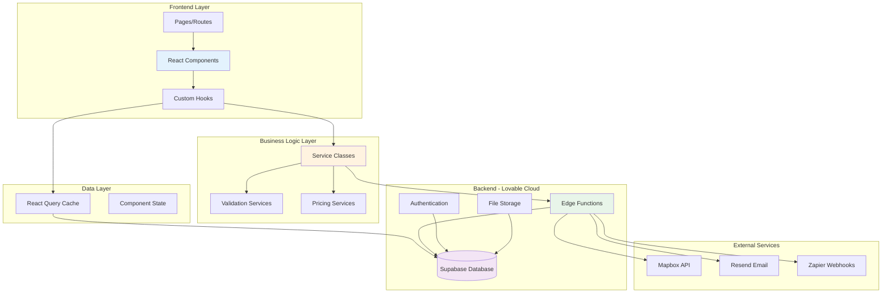

---

## Service Layer Architecture

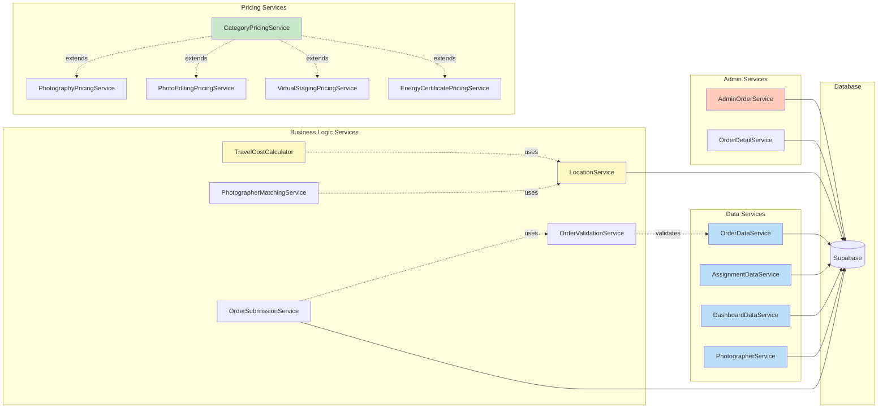

---

## Data Flow Architecture

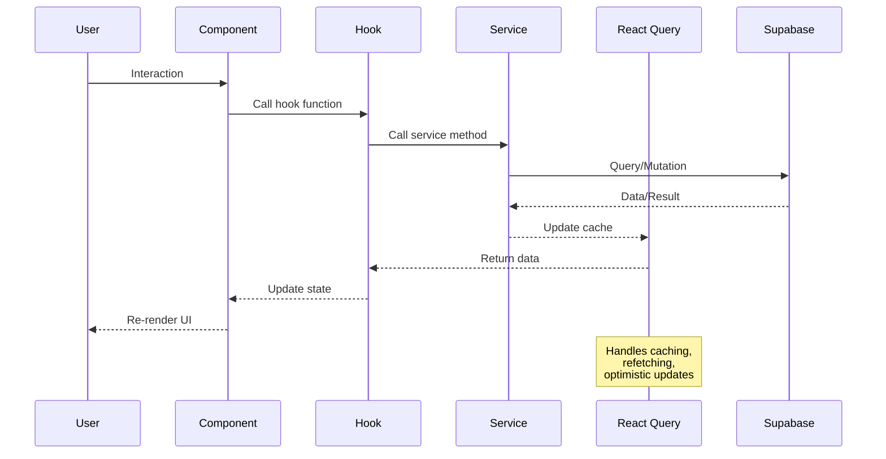

---

## Component Hierarchy

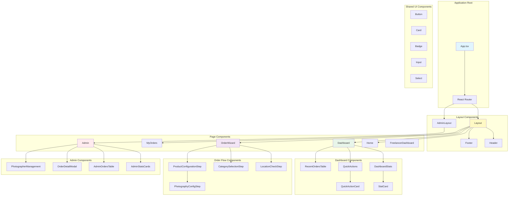

---

## Testing Architecture

```mermaid
graph TB
    subgraph "Test Types"
        Unit[Unit Tests<br/>120+ tests]
        Component[Component Tests<br/>105+ tests]
        Integration[Integration Tests<br/>41 tests]
        E2E[E2E Tests<br/>Proposed]
    end
    
    subgraph "Unit Test Coverage"
        ServiceTests[Service Layer Tests]
        HookTests[Hook Tests]
        UtilTests[Utility Tests]
        PricingTests[Pricing Logic Tests]
    end
    
    subgraph "Component Test Coverage"
        UITests[UI Component Tests]
        A11yTests[Accessibility Tests]
        SnapshotTests[Snapshot Tests]
    end
    
    subgraph "Integration Test Coverage"
        FlowTests[Order Flow Tests]
        StateTests[State Management Tests]
        ValidationTests[Validation Tests]
    end
    
    subgraph "Testing Tools"
        Vitest[Vitest Test Runner]
        RTL[React Testing Library]
        JestAxe[jest-axe a11y]
        UserEvent[@testing-library/user-event]
    end
    
    Unit --> ServiceTests
    Unit --> HookTests
    Unit --> UtilTests
    Unit --> PricingTests
    
    Component --> UITests
    Component --> A11yTests
    Component --> SnapshotTests
    
    Integration --> FlowTests
    Integration --> StateTests
    Integration --> ValidationTests
    
    ServiceTests -.uses.-> Vitest
    HookTests -.uses.-> Vitest
    HookTests -.uses.-> RTL
    UITests -.uses.-> RTL
    UITests -.uses.-> UserEvent
    A11yTests -.uses.-> JestAxe
    FlowTests -.uses.-> RTL
    FlowTests -.uses.-> UserEvent
    
    style Unit fill:#bbdefb
    style Component fill:#c8e6c9
    style Integration fill:#fff9c4
    style E2E fill:#ffccbc
    style Vitest fill:#e1bee7
```

---

## Order Flow Sequence

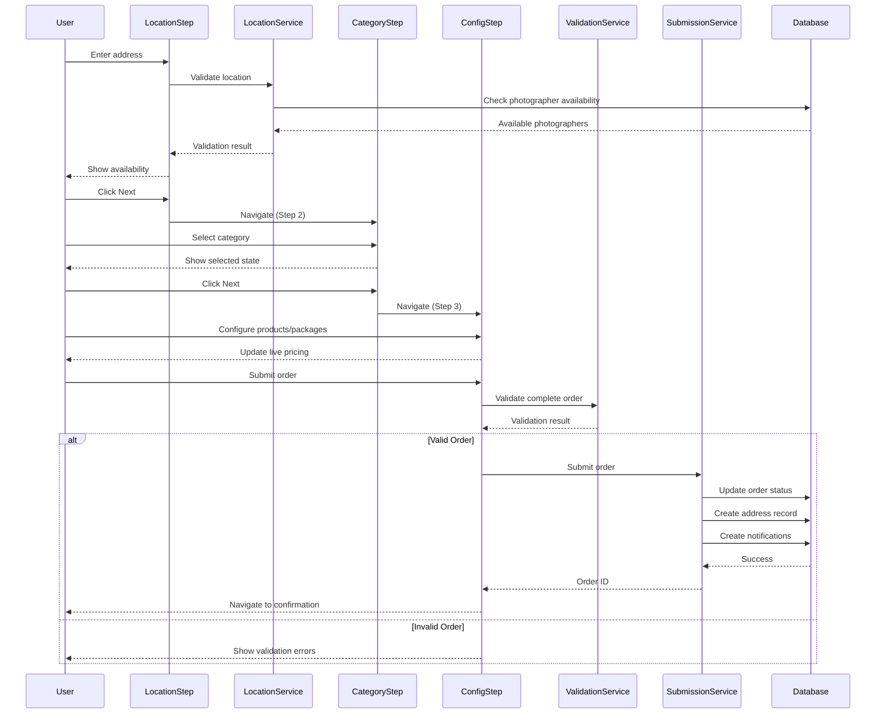

---

## Authentication Flow

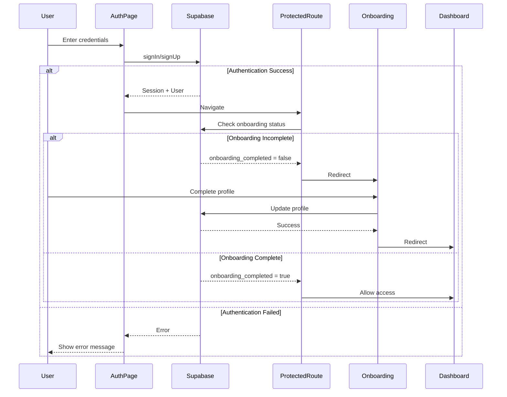

---

## Database Schema

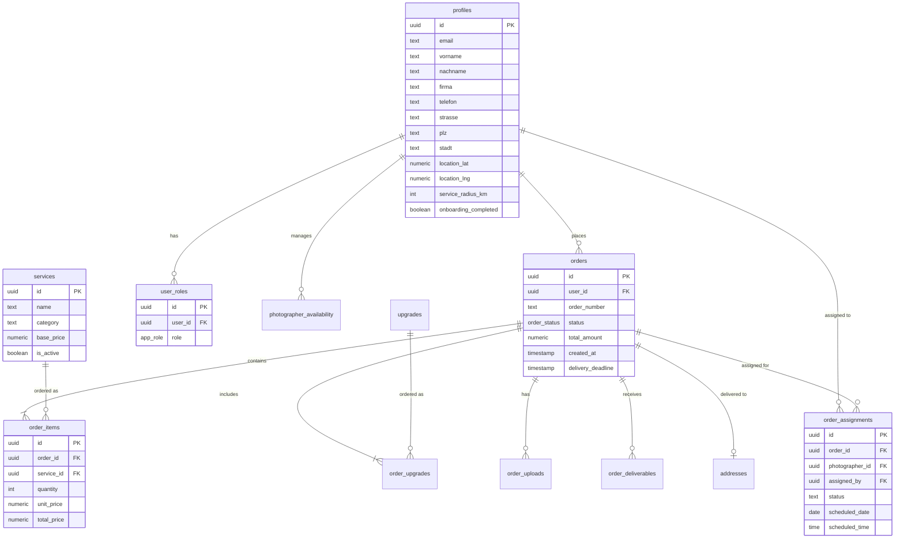

---

## Custom Hook Architecture

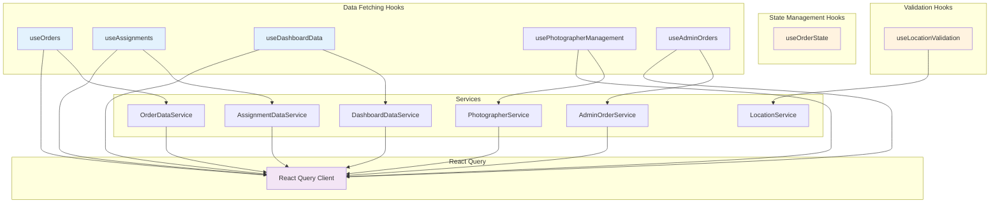

---

## Pricing System Architecture

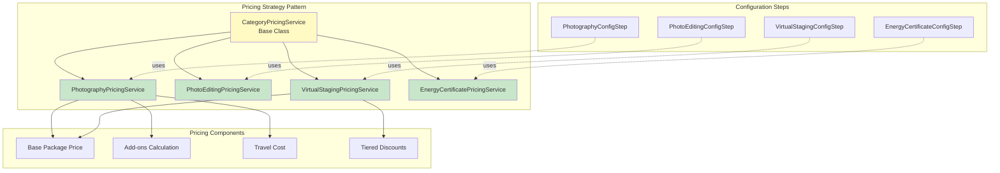

---

## Admin Dashboard Architecture

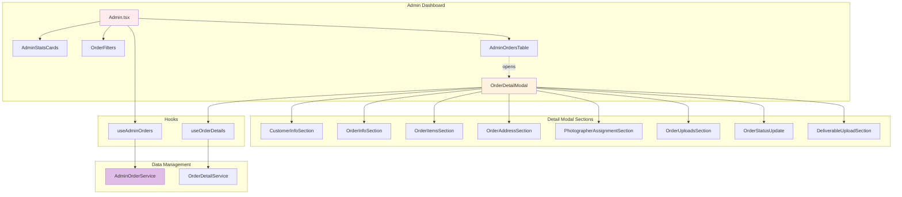

---

## Photographer Management Flow

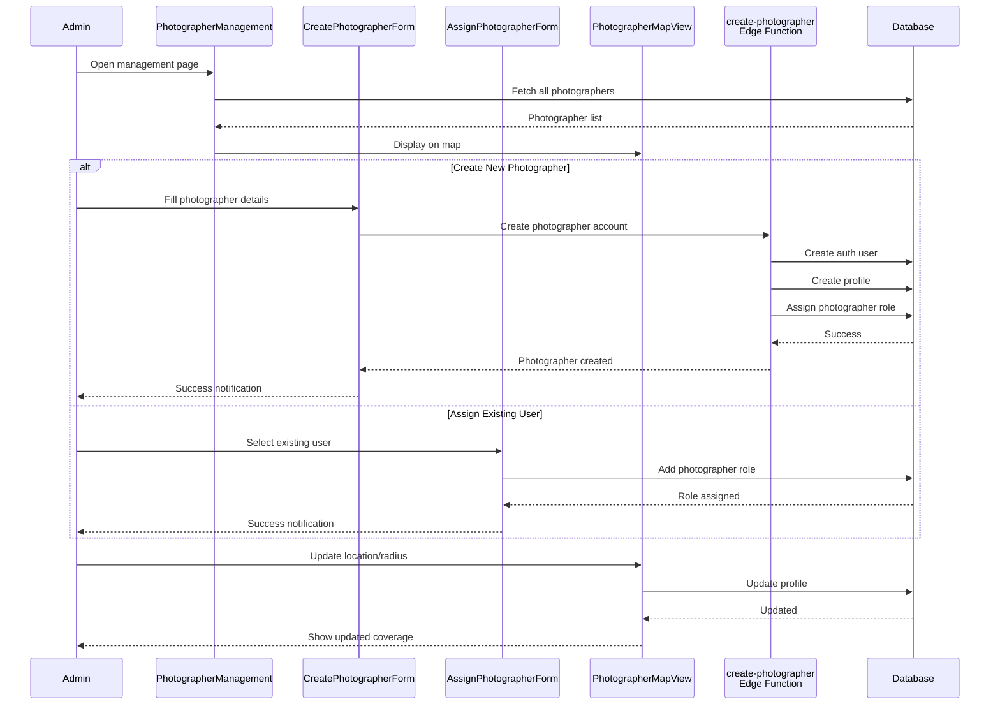

---

## File Storage Architecture

```mermaid
graph LR
    subgraph "Client Upload"
        User[User]
        FileUpload[FileUploadZone]
    end
    
    subgraph "Validation"
        ValidateEdgeFn[validate-file-upload<br/>Edge Function]
    end
    
    subgraph "Storage Buckets"
        OrderUploads[(order-uploads<br/>Bucket)]
        OrderDeliverables[(order-deliverables<br/>Bucket)]
    end
    
    subgraph "Database"
        UploadsTable[order_uploads Table]
        DeliverablesTable[order_deliverables Table]
    end
    
    User --> FileUpload
    FileUpload --> ValidateEdgeFn
    ValidateEdgeFn -.checks.-> FileUpload
    
    alt Valid File
        FileUpload --> OrderUploads
        OrderUploads --> UploadsTable
    end
    
    subgraph "Admin Delivery"
        Admin[Admin]
        DeliverableUpload[DeliverableUploadSection]
    end
    
    Admin --> DeliverableUpload
    DeliverableUpload --> OrderDeliverables
    OrderDeliverables --> DeliverablesTable
    
    style OrderUploads fill:#e3f2fd
    style OrderDeliverables fill:#c8e6c9
```

---

## Edge Functions Architecture

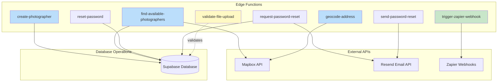

---

## Notification System

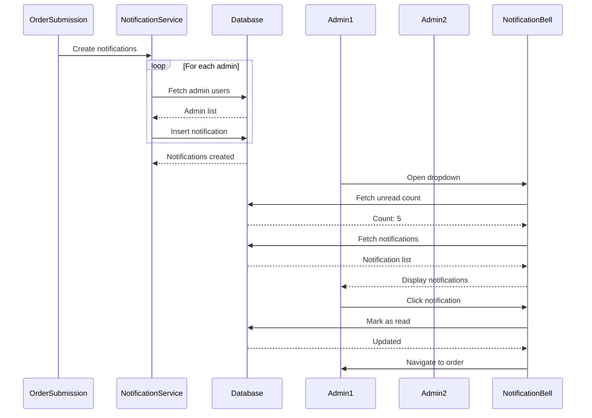

---

## Key Architectural Decisions

### 1. Service Layer Pattern
- **Decision**: Implement dedicated service classes for business logic
- **Benefits**: 
  - Separation of concerns
  - Testability
  - Reusability
  - Maintainability

### 2. Custom Hooks for State
- **Decision**: Create custom hooks wrapping services + React Query
- **Benefits**:
  - Encapsulated data fetching
  - Automatic caching
  - Optimistic updates
  - Consistent error handling

### 3. Strategy Pattern for Pricing
- **Decision**: Base pricing service with category-specific implementations
- **Benefits**:
  - Extensibility for new categories
  - Consistent interface
  - Isolated pricing logic

### 4. Component Composition
- **Decision**: Break large components into focused sub-components
- **Benefits**:
  - Reusability
  - Easier testing
  - Better readability
  - Reduced complexity

### 5. Validation Layer
- **Decision**: Dedicated validation services
- **Benefits**:
  - Centralized validation logic
  - Consistent error messages
  - Business rule enforcement
  - Easy to test

---

## Performance Optimizations

### 1. React Query Caching
```typescript
// Configured cache times
staleTime: 30000,  // 30 seconds
gcTime: 300000,    // 5 minutes
```

### 2. Component Lazy Loading
```typescript
const OrderWizard = lazy(() => import('./OrderWizard'));
```

### 3. Memoization
```typescript
const memoizedValue = useMemo(() => 
  expensiveCalculation(data), 
  [data]
);
```

### 4. Query Key Management
```typescript
queryKey: ['user-orders', user?.id]  // Automatic invalidation
```

---

## Security Architecture

### 1. Row-Level Security (RLS)
```sql
-- Users can only view their own orders
CREATE POLICY "Users can view their own orders"
ON orders FOR SELECT
USING (auth.uid() = user_id);

-- Admins can view all orders
CREATE POLICY "Admins can view all orders"
ON orders FOR SELECT
USING (is_admin(auth.uid()));
```

### 2. Role-Based Access Control
```typescript
// Separate user_roles table
// Security definer functions: is_admin(), has_role()
// Protected routes with role checks
```

### 3. Edge Function Security
```typescript
// Service role access for elevated permissions
// Rate limiting on sensitive endpoints
// Input validation and sanitization
```

---

## Deployment Architecture

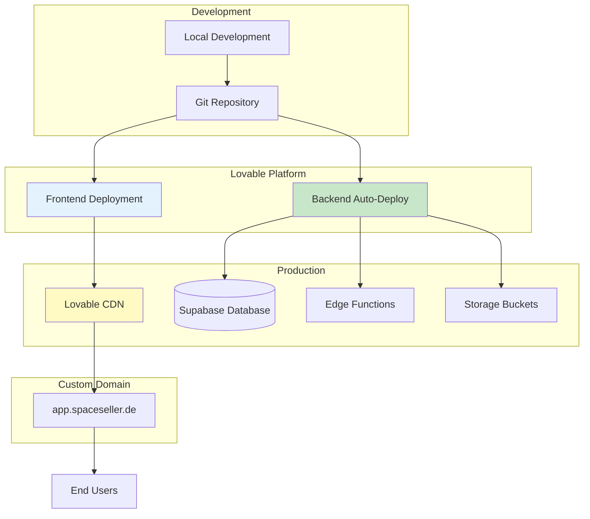

---

## Monitoring & Logging

### Database Monitoring
- Query performance tracking
- Connection pool monitoring
- RLS policy verification

### Application Monitoring
- Error tracking via console
- Network request logging
- User interaction analytics

### Edge Function Logging
- Execution logs
- Error rates
- Latency metrics

---

## Future Architecture Enhancements

### 1. Real-time Features
- WebSocket connections for live updates
- Real-time order status changes
- Live photographer availability

### 2. Advanced Caching
- Service worker for offline support
- IndexedDB for local data persistence
- Background sync for uploads

### 3. Performance Monitoring
- Lighthouse CI integration
- Core Web Vitals tracking
- Bundle size monitoring

### 4. E2E Testing
- Playwright test suite
- Visual regression testing
- Performance testing

---

*Generated: 2025-01-23*
*Project: Spaceseller Platform*
*Refactoring Phases: 1-12*
